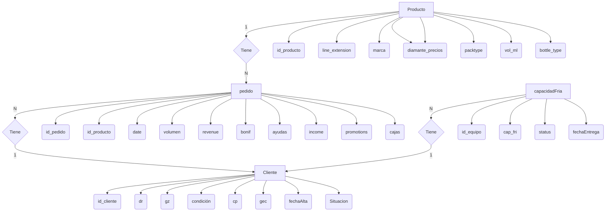

# Tarea 2: Modelo Entidad Relación: 

```mermaid

graph TD
    C1[Cliente] --> c1_id(id_cliente)
    C1[Cliente] --> c2(dr)
    C1[Cliente] --> c3(gz)
    C1[Cliente] --> c4(condición)
    C1[Cliente] --> c5(cp)
    C1[Cliente] --> c6(gec)
    C1[Cliente] --> c7(fechaAlta)
    C1[Cliente] --> c8(Situacion)

    re_1{Tiene} -->|1| C1[Cliente]
    p1[Pedido] -->|N|re_1{Tiene}

    p1[pedido] --> p2(id_pedido)
    p1[pedido] --> p3(id_producto)
    p1[pedido] --> p4(date)
    p1[pedido] --> p5(volumen)
    p1[pedido] --> p7(revenue)
    p1[pedido] --> p8(bonif)
    p1[pedido] --> p9(ayudas)
    p1[pedido] --> p10(income)
    p1[pedido] --> p11(promotions)
    p1[pedido] --> P6(cajas)

    re_2{Tiene} -->|1| C1[Cliente]
    cap[CapacidadFria] -->|N|re_2{Tiene}

    cap[capacidadFria] --> cap1(id_equipo)
    cap[capacidadFria] --> cap2(cap_fri)
    cap[capacidadFria] --> cap3(status)
    cap[capacidadFria] --> cap4(fechaEntrega)

    re_3{Tiene} -->|N| p1[pedido]
    catsku[Producto] -->|1|re_3{Tiene}

    catsku[Producto] --> cat1(id_producto)
    catsku[Producto] --> cat2(line_extension)
    catsku[Producto] --> cat3(marca)
    catsku[Producto] --> cat4(tipoliquido)
    catsku[Producto] --> cat4(diamante_precios)
    catsku[Producto] --> cat5(packtype)
    catsku[Producto] --> cat6(vol_ml)
    catsku[Producto] --> cat7(bottle_type)


```
