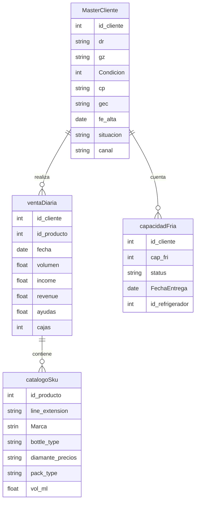

# Modelo Entidad Relación 

Para el proyecto final el modelo de entidad Relación será el siguiente: 

```mermaid
erDiagram
    MasterCliente ||--o{ ventaDiaria : realiza
    MasterCliente {
        int id_cliente
        string dr
        string gz
        int Condicion
        string cp
        string gec
        date fe_alta
        string situacion
        string canal
    }
    ventaDiaria {
        int id_cliente
        int id_producto
        date fecha
        float volumen 
        float income
        float revenue
        float ayudas
        int   cajas
        }
    MasterCliente ||--o{ capacidadFria : cuenta
    capacidadFria {
        int id_cliente
        int cap_fri
        string status
        date FechaEntrega
        int id_refrigerador 
        }
    ventaDiaria ||--o{ catalogoSku : contiene
    catalogoSku {
        int id_producto
        string line_extension
        strin  Marca
        string bottle_type
        string diamante_precios
        string  pack_type
        float vol_ml 
        }
```
