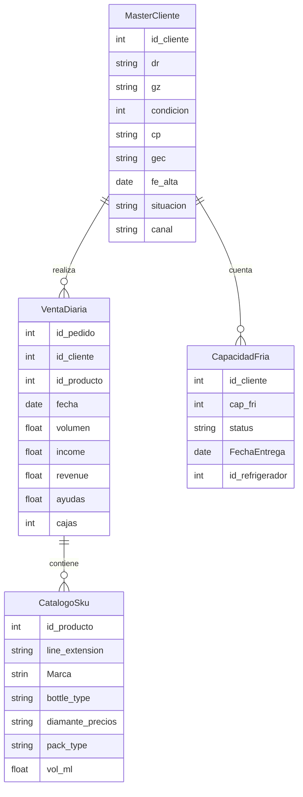

# Modelo Relacional

## Esquema Modelo Relacional

MasterCliente( <u>id_cliente</u>, dr, gz, condicion,cp, gec, fe_alta, situacion, canal)

VentaDiaria( <u>id_pedido</u>, fecha, volumen, income, promotion, revenue, ayudas, cajas, id_cliente, id_producto)

CapacidadFria( <u>id_refrigerador</u>, cap_fri, status, fechaEntrega, id_cliente)

CatalogoSku( <u>id_producto</u>, lineExtension, marca, bottle_type, diamante_precios, pack_type, vol_ml)

MasterCliente_VentaDiaria(id_cliente, id_cliente)

MasterCliente_CapacidadFria(id_cliente, id_cliente)

ventaDiaria_CatalogoSku(id_producto, id_producto)

## Diagrama entidad Relación

## Operaciones mediante operadores de algebra relacional

* traemos las columnas id_cliente y producto de los clientes del canal offtrade y con un volumen por producto mayor que 300 hl

$$\prod{}_{idCliente, lineExtension} \left(\sigma_{Cliente\cdot canal =offtrade \bigvee VentaDiaria\cdot volumen > 300 }\left(MasterClientes   \times  VentaDiaria \right) \right) $$

* traemos las columnas id_cliente, status y capacidad fria de los clientes del canal ontrade  y que cumplan con las siguientes condiciones (que su situacion de equipo sea en apego o capacidad fria mayor a 500 botellas)

$$\prod{}_{idCliente, capFria, status, volumen } \left(\sigma_{MasterClientes\cdot canal = ontrade \bigvee (  CapacidadFria \cdot Status = EnApego \bigwedge  CapacidadFria \cdot capFri > 500) }\left(MasterClientes   \times  VentaDiaria  \times CapacidadFria \right) \right) $$

* traemos todos los clientes que hayan comprado  la line extension Heineken Silver y mas de 3caja

$$\prod{}_{idCliente } \left(\sigma_{CatSkus\cdot lineExtension = HeinekenSilver \bigvee   ventaDiaria \cdot cajas > 3 }\left(MasterClientes   \times  VentaDiaria  \times catalogoSKU \right) \right) $$

* traemos las columnas clientes y marcas donde se filtraran aquellos clientes que compren productos del diamante de precios mainstream o premium 

$$\prod{}_{idCliente, marca } \left(\sigma_{CatSkus\cdot diamantePrecios = mainstream \bigwedge   CatSkus\cdot diamantePrecios = premium }\left(MasterClientes   \times  VentaDiaria  \times catalogoSKU \right) \right) $$